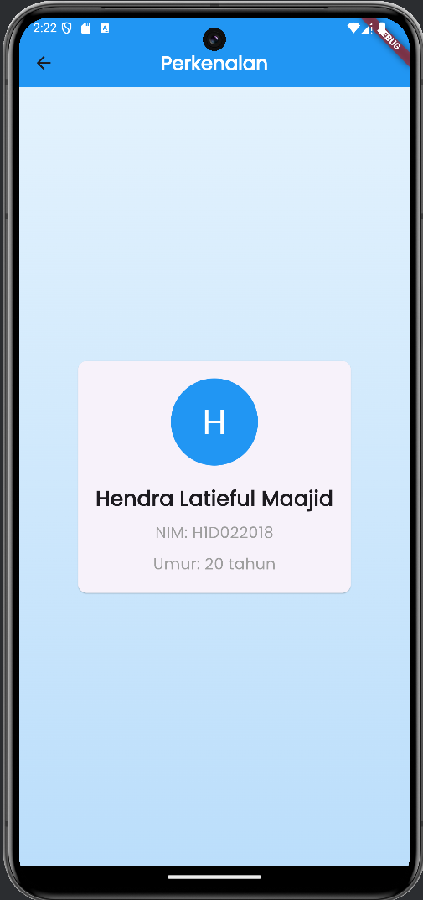

# Tugas Pertemuan 2


Nama : Hendra Latieful Maajid

NIM : H1D022018

Shift Baru: F


# Penjelasan Proses Passing Data dari Form ke Tampilan

Aplikasi ini terdiri dari dua bagian utama: `FormData` untuk mengumpulkan input pengguna, dan `TampilData` untuk menampilkan data yang diinput. Berikut adalah penjelasan tentang bagaimana data dilewatkan dari form ke tampilan.

## Komponen Utama

1. **FormData** (`form_data.dart`)
    - Widget yang menangani input pengguna
    - Menggunakan `TextFormField` untuk mengumpulkan nama, NIM, dan tahun lahir

2. **TampilData** (`tampil_data.dart`)
    - Widget yang menampilkan data yang telah diinput
    - Menerima data sebagai parameter konstruktor

## Proses Passing Data

1. **Pengumpulan Data di FormData**
    - Data diinput oleh pengguna melalui `TextFormField`
    - Data disimpan dalam `TextEditingController`:
      ```dart
      final _namaController = TextEditingController();
      final _nimController = TextEditingController();
      final _tahunController = TextEditingController();
      ```

2. **Validasi Data**
    - Saat tombol "Simpan" ditekan, method `_submitForm()` dipanggil
    - Form divalidasi menggunakan `_formKey.currentState!.validate()`

3. **Persiapan Data untuk Passing**
    - Jika validasi berhasil, data diekstrak dari controller:
      ```dart
      String nama = _namaController.text;
      String nim = _nimController.text;
      int tahun = int.parse(_tahunController.text);
      ```

4. **Navigasi dan Passing Data**
    - Menggunakan `Navigator.push()` untuk berpindah ke `TampilData`
    - Data dilewatkan sebagai argumen konstruktor:
      ```dart
      Navigator.of(context).push(MaterialPageRoute(
        builder: (context) => TampilData(nama: nama, nim: nim, tahun: tahun),
      ));
      ```

5. **Penerimaan Data di TampilData**
    - `TampilData` menerima data melalui konstruktor:
      ```dart
      const TampilData({
        Key? key,
        required this.nama,
        required this.nim,
        required this.tahun,
      }) : super(key: key);
      ```

6. **Penggunaan Data di TampilData**
    - Data yang diterima digunakan untuk membangun UI:
      ```dart
      Text(
        nama,
        style: const TextStyle(fontSize: 24, fontWeight: FontWeight.bold),
      ),
      Text(
        "NIM: $nim",
        style: const TextStyle(fontSize: 18, color: Colors.grey),
      ),
      Text(
        "Lahir Tahun: $tahun",
        style: const TextStyle(fontSize: 18, color: Colors.grey),
      ),
      ```

Dengan proses ini, data yang diinput oleh pengguna di `FormData` berhasil dilewatkan dan ditampilkan di `TampilData`.
## Screenshot
Contoh :


